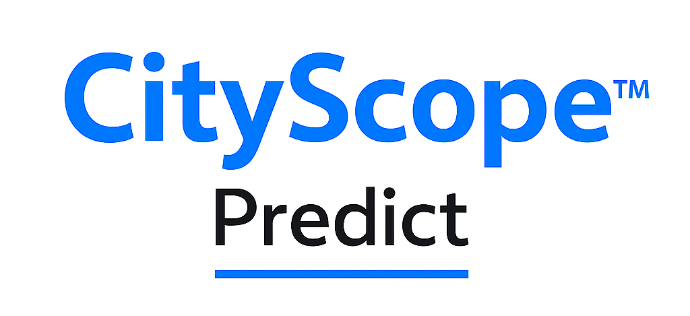
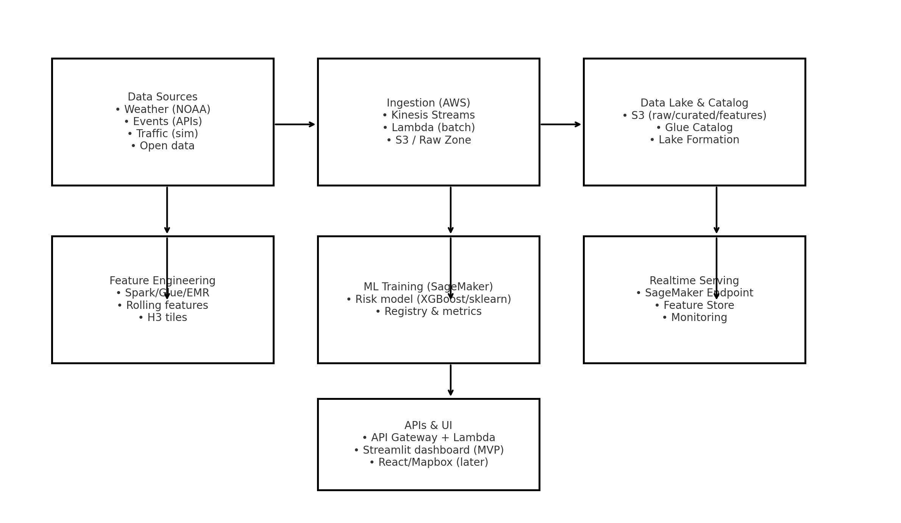
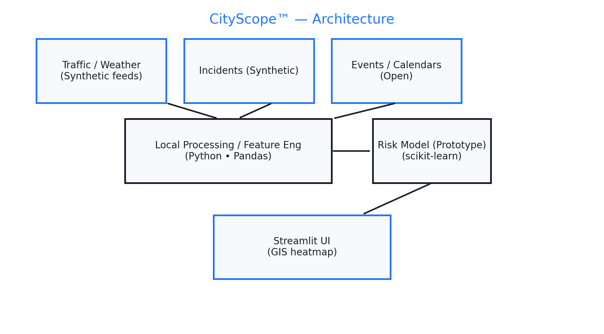
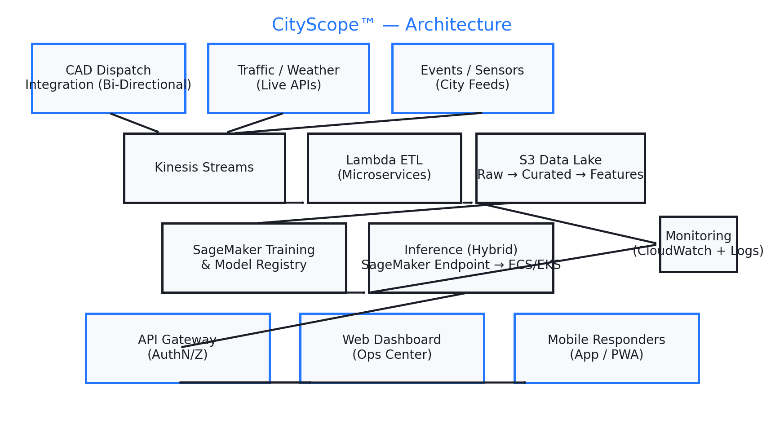

# CityScope™ — Critical Incident Response Predictive System (Denver MVP)

**Career-first portfolio project** showcasing end-to-end **Data Engineering + MLOps + Geospatial ML**.

**Stack (MVP):** AWS (S3, Glue, Kinesis, SageMaker), Python, Pandas, scikit-learn, Streamlit, Map tiles.  
**Demo focus:** Denver metro — risk heatmap (30–60 min horizon), basic ETA baseline, events + weather influence.



## 📊 CityScope Pitch Deck

CityScope™ empowers faster and smarter critical incident response through 
real-time risk prediction, geospatial analytics, and cloud-scale data engineering.

[▶️ View Presentation (PDF)](architecture/pitch_deck/CityScope_Pitch_Deck.pptx)
### 🏗️ Architecture Overview

#### ✅ Current MVP Architecture (Denver Prototype)


#### 🚀 Scalable AWS Architecture (Future Vision)


Showcases:
- Denver MVP prototype
- Incident risk prediction concept
- Cloud + data engineering architecture
- ML + routing optimization roadmap


## What this repo shows (public)
- Clean cloud architecture (AWS-first)
- Synthetic/open data ingestion examples
- Feature engineering & baseline ML for **incident risk**
- Streamlit dashboard prototype
- Hiring-ready docs & diagrams

> ⚠️ **IP Note:** Commercial integrations (CAD/AVL), advanced routing logic, and production MLOps are intentionally **omitted** from this public repo. Use of the code is **Non-Commercial**; see `LICENSE`.

## Quickstart

1. **Create a virtual environment**
```bash
python -m venv .venv && source .venv/bin/activate  # (Windows: .venv\Scripts\activate)
pip install -r requirements.txt
```

2. **Run the synthetic ML demo**
```bash
jupyter notebook ml/incident_risk_baseline.ipynb
```

3. **Launch the dashboard (stub)**
```bash
streamlit run dashboard/prototype_streamlit_app.py
```

## Repository layout
```
CityScope/
 ├─ architecture/            # diagrams, PPT/PDF
 ├─ data/synthetic/          # generated demo data
 ├─ etl/                     # example ingestion (Lambda stub)
 ├─ ml/                      # notebooks & models
 ├─ dashboard/               # Streamlit MVP
 ├─ infra/terraform/         # optional IaC (skeleton)
 └─ docs/                    # feature notes, references
```

## Roadmap
- [ ] Add H3 tiling + tile features
- [ ] Realtime feature stream (Kinesis → Feature Store)
- [ ] ETA baseline + routing re-score
- [ ] Model monitoring & drift alerts
- [ ] React + Mapbox UI (later)

## Attribution
© 2025 CityScope™. Non-Commercial license. See `LICENSE`.
